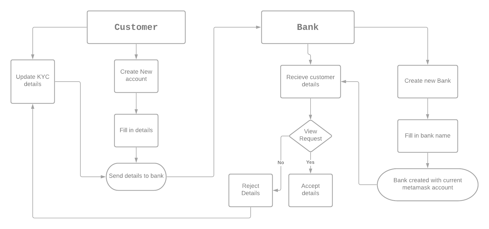

# KYC on Blockchain
We all know how difficult it is for a normal user to get his KYC data verified from any third party source or banks. Privacy will always be treated as a joke until technologies such as Bloackchain, IPFS are rapidly used in daily life applications. We made a KYC application that uses blockchain as a database which ensures security and privacy of a user. This application is deployed and tested on a local test network such as Ganache using truffle and web3.js. 

# Techonologies Used
frontend - ReactJS
backend - Ethereum Developement Network (Ganache), web3.js, truffle

# Commands
  1) to run the front end, cd into client folder and then npm install or npm i to install all the dependencies
  2) truffle migrate -- reset
  3) ganache-cli or you can use the Ganache Application

# Things to keep in mind before running the code
  1) Since this project only supports development networks, check if Ganache Network is running behind.
  2) Also remember to change port to 8545 from 7545 if using ganache-cli.
  3) Do make sure you create bank accounts before creating a customer.

# Logic flow of the application working

